As part of developing [Git-Mastery](https://git-mastery.github.io), I had to publish the [app](https://git-mastery.github.io/app) across as many operating systems as possible for students to download it.

[Debian](https://www.debian.org/) was a target operating system as students may be using Debian/[Ubuntu](https://ubuntu.com/)/some [Debian-based Linux distro](https://distrowatch.com/search.php?basedon=Debian) as their daily driver or they may be using [Ubuntu for Windows Subsystem for Linux (WSL)](https://ubuntu.com/desktop/wsl) on Windows.

Surprisingly, the process of packaging the app for Debian was way more involved than I had originally anticipated, taking over a day of experimentation to integrate with [GitHub Actions](https://github.com/features/actions).

While there are several nice guides covering individual steps of this process, I found myself having to piece them together as I was working on this that, and I had eventually [compiled a set of pretty comprehensive notes](https://woojiahao.notion.site/linux-packaging-226f881eda0580d68bc8dc6f8e1d5d0d?source=copy_link) on my findings.

I wanted to use this opportunity to consolidate my process and hopefully remove the awkwardness on figuring out how to package and publish applications on Debian!

> I am not claiming to be subject matter expert, and I may have some inefficient steps below!
>
> If you spot any, feel free to [drop me an email](mailto:woojiahao1234@gmail.com) and I will improve it!

## What will be covered?

This guide hopes to cover the following core topics:

1. Packaging your application on Debian (creating a `.deb` file)
2. Creating a Debian repository using `reprepo` and GitHub Pages
3. Publishing multi-architecture packages
4. Automating packaging and publishing using GitHub Actions

## Prerequisites

Before packaging your application, you first need to create an ELF binary of your program (which I will refer to as a "binary" or "executable" from here on out). I will use the Git-Mastery app binary for reference.

:::callout{.info}
If you wish to follow along, you can get `v7.1.2` of the [binary on ARM64 here](https://github.com/git-mastery/app/releases/download/v7.1.2/gitmastery-7.1.2-linux-arm64).
:::

The Git-Mastery app uses [PyInstaller](https://pyinstaller.org/en/stable/) to bundle the CLI into a single executable, and it uses the [Ubuntu GitHub Actions image](https://github.com/actions/runner-images) to generate this executable across architectures.

If you are not using GitHub Actions, the next easiest option is to use a [Virtual Machine](https://www.vmware.com/topics/virtual-machine) (VM) to build it. You can also use the VM to run through the individual steps of packaging, so I highly recommend setting one up now. I have included my set-up for a Debian ARM64 VM on MacOS Apple Silicon in [the appendix below](#appendix-setting-up-a-debian-vm-on-macos-apple-silicon).

Finally, you will need to ensure that you have the `devscripts` and `debhelper-compat` packages installed in your environment.

In Debian, you can install it using `apt`:

```bash
sudo apt-get install devscripts build-essential debhelper-compat
```

## Core concepts

The [official introduction to packaging on Debian](https://wiki.debian.org/Packaging/Intro) provides some high-level details about the packaging process that I will (shamelessly) copy over to explain some fundamental concepts.

- **Upstream tarball:** a [tarball](https://en.wikipedia.org/wiki/Tarball_(computing)) (`.tar.gz` or `.tgz`) that contains the software that has been written (i.e. it contains the executable)
- **Source package:** built from the upstream source; "contains the upstream source distribution, configuration for the package build system, list of runtime dependencies and conflicting packages, …"
- **Binary package:** built from the source package which is then distributed and installed; contains (among other things) the executables and resources required for the executable to run

In our context, the upstream tarball simply contains the executable that you intend to publish and the binary package is the resulting `.deb` file that is consumed by users, so these should be relatively straightforward to understand.

Instead, the focus of this guide is the construction of the source package, allowing tools like `dpkg-buildpackage` ([man](https://man7.org/linux/man-pages/man1/dpkg-buildpackage.1.html)) to build and create the binary package.

The simplest source package consists of:

1. The upstream tarball
2. A `debian/` directory containing the changes made to the upstream source and all files required for the creation of the binary package
3. A description file (`.dsc`) which contains metadata about the above files

This guide will focus on these three as the primary packaging workflow.

## **Creating the upstream tarball**

Given that you are packaging your own application, you will first create the upstream tarball.

Start by creating a folder for your executable. I chose to name mine using the following convention `<name>-<version>-<architecture>`.

```bash
mkdir gitmastery-7.1.2-arm64/
```

Then, copy the executable into this folder.

```bash
cp gitmastery-7.1.2-linux-arm64 gitmastery-7.1.2-arm64/
```

Finally, generate the tarball following naming convention: `<name>_<version>.orig.tar.gz`.

```bash
tar -czf gitmastery_7.1.2.orig.tar.gz gitmastery-7.1.2-arm64/gitmastery-7.1.2-linux-arm64
```

## **Creating the `debian/` directory**

Navigate into the folder containing your executable.

```bash
cd gitmastery-7.1.2-arm64/
```

Then, create a sub-folder named `debian`.

```bash
mkdir debian
```

This is where all the configuration about packaging your application will be held.

There are several files you will need within `debian/` to tell the packaging tool how to create your package:

1. `debian/changelog`

    The [Debian Changelog](https://wiki.debian.org/DebianChangelog) is where you (as the maintainer) log the changes to a package. If you are packaging the application using GitHub Actions, you could lift it from the latest commit message on the repository.

    ```bash
    git show v7.1.2 --no-patch --pretty=format:%s
    ```

    Otherwise, you can specify it directly when generating the file using `dch` ([man](https://manpages.debian.org/jessie/devscripts/dch.1.en.html)).

    ```bash
    dch --create -v 7.1.2-1 -u low --package gitmastery "Changed things"
    ```

    - `--create` : generates a new `debian/changelog` file (note that it expects the `debian/` sub-folder so run this command outside of the `debian/` sub-folder)
    - `-v 7.1.2-1`: specifying the version of the application listed in the changelog; `-1` indicates the release number of the package
    - `-u low`: indicates the [urgency](https://lists.debian.org/debian-mentors/2008/02/msg00567.html) of the changelog entry; tied to the [Debian "testing" distribution](https://www.debian.org/devel/testing); `low` implies that the package may transition to "testing" in 10 days
    - `--package`: name of the package
2. `debian/control`

    The `control` file describes the source and binary package, providing information about the name, maintainers, and build dependencies.

    You can generate this file using the following template:

    ```text
    Source: gitmastery
    Maintainer: Jiahao, Woo <woojiahao1234@gmail.com>
    Section: misc
    Priority: optional
    Standards-Version: 4.7.0
    Build-Depends: debhelper-compat (= 13)

    Package: gitmastery
    Architecture: arm64
    Depends: ${shlibs:Depends}, ${misc:Depends}, libc6 (>= 2.35), python3
    Description: execute Git-Mastery
      gitmastery is a Git learning tool built by the National University of Singapore School of Computing
    ```

    It is broken up into two parts: source and binary.

    In the source section:

    - `Source`: source package name
    - `Maintainer`: name and email of the person responsible for the package; follows the `$NAME <$EMAIL>` format
    - `Priority`: priority of the package to indicate whether the package is important to the standard functioning system; one of `required`, `important`, `standard`, `optional`
    - `Build-Depends`: list of packages that need to be installed to build the package (note this does not imply that the package can run with these dependencies, just that it can be built)

    In the binary section:

    - `Package`: name of the binary package which might differ from the source package name (in our case it doesn’t)
    - `Architecture`: specifies the computer architecture where the binary package is expected to work, including `arm64` and `amd64` (the two primary architectures I chose to focus on)
    - `Depends`: list of packages that must be installed for the program in the binary package to work; `${shlibs:Depends}` are the packages that contain built shared libraries and executables and `${misc:Depends}` contain the packages like `debhelper` (here we also list `libc` and `python3` as extra dependencies)
    - `Description`: full description of the binary package; first line is a summary and the rest of the lines are a longer description
3. `debian/copyright`

    The name is pretty self-explanatory - this contains the copyright information about the package.

    You are able to leave this blank, but when packaging the Git-Mastery app, I had opted to instead copy over the `LICENSE` of the application, which happens to be the [MIT license](https://opensource.org/license/mit).

4. `debian/rules`

    These provide the rules for installation, including how/where the application should be installed.

    The file format is that of a [Makefile](https://makefiletutorial.com/).

    ```makefile
    #!/usr/bin/make -f
    %:
            dh $@

    override_dh_auto_install:
            install -D -m 0755 gitmastery-7.1.2-linux-arm64 debian/gitmastery/usr/bin/gitmastery
    ```

    While the official installation guide starts with a rather sparse file (that they build upon):

    ```makefile
    #!/usr/bin/make -f
    %:
            dh $@
    ```

    I have found - through experimentation - that the binary package will not work unless you provide the `override_dh_auto_install` step ([more information](https://www.debian.org/doc/manuals/maint-guide/dreq.en.html#rules)) where you need to specify how and where the application is getting installed using the `install` ([man](https://man7.org/linux/man-pages/man1/install.1.html)) command.

    - `-D`: create all leading components of the destination except the last (i.e. create all sub-folders) and then copy the source to the destination
    - `-m 0755`: set the permission mode
    - `debian/gitmastery/usr/bin/gitmastery`: the leading `debian/gitmastery` is necessary because it indicates the [fakeroot](https://wiki.debian.org/FakeRoot) before packaging; the ultimate path upon installation is `/usr/bin/gitmastery` (this can be verified upon installation).
5. `debian/$NAME.dirs`

    This serves as a directory declaration file used by the `dh_installdirs` ([man](https://man7.org/linux/man-pages/man1/dh_installdirs.1.html)).

    For the Git-Mastery, I have left it blank, but if you create your file as `debian/test.dirs`, and specify a path `usr/bin`, it would then create `debian/test/usr/bin`.

6. `debian/source/format`

    This specifies the version number for the [format of the source package](https://debian-handbook.info/browse/stable/sect.source-package-structure.html).

    ```makefile
    3.0 (quilt)
    ```

    `quilt` ([docs](https://perl-team.pages.debian.net/howto/quilt.html)) is used to manage patches to Debian packages.

7. `debian/source/include-binaries`

    Given that we’re directly installing the binary, we need to provide its path in this file.

    ```makefile
    gitmastery-7.1.2-linux-arm64
    ```

## Creating the `.deb` file

That is all the files we really need to package the application.

With this, we can finally package the application:

```bash
dpkg-buildpackage -us -uc -a arm64
```

You want to run this command in the root of your directory, not within `debian/`!

- `-us`: do not sign the source package
- `-uc`: do not sign the `.buildinfo` and `.changes` files
- `-a arm74`: specify the architecture

This produces the `.deb` file with the name `<NAME>_<VERSION>-1_<ARCHITECTURE>.deb`.

You can verify the package using `sudo dpkg -i <package>`. Once installed, you can also check to confirm where the binary was installed using `which gitmastery`.

Now, if all you wanted to do was to create a one-off `.deb` and share it with someone directly, you’re done! Congratulations 🎉!

But if you want to publish this `.deb` to a Debian repository for the `apt` package manager or automate the entire process, read on!

## Setting up the Debian repository using `reprepro`

`reprepro` ([repository](https://github.com/ionos-cloud/reprepro)) is used to create a [Debian repository](https://wiki.debian.org/DebianRepository), but it also works well to host your package so that it is discoverable by through the `apt` package manager via [third-party repositories](https://documentation.ubuntu.com/server/explanation/software/third-party-repository-usage/#dealing-with-third-party-apt-repositories-in-ubuntu).

As a Debian repository is just a set of files organized in a special directory tree with different infrastructure files, it can be hosted through a static site platform like [GitHub Pages](https://docs.github.com/en/pages). But before we get ahead of ourselves with hosting, let’s figure out how to first generate the necessary files.

I had initially followed this wonderful guide on the DigitalOcean community tutorial blog on "[How to Use Reprepro for a Secure Package Repository on Ubuntu 14.04](https://www.digitalocean.com/community/tutorials/how-to-use-reprepro-for-a-secure-package-repository-on-ubuntu-14-04)" but I have adapted it for my (and hopefully your) use case!

Install `reprepro` on your machine.

```bash
apt-get update
apt-get install reprepro
```

Then, create a folder to store the files:

```bash
mkdir repo && cd repo
```

With this, we can start the process of setting up the Debian repository.

Create a [GPG key](https://www.gnupg.org/faq/gnupg-faq.html). If you already have a GPG key, you might find [this discussion](https://superuser.com/questions/1683772/should-i-create-separate-gpg-key-pairs-or-just-one-gpg-key-pair-for-multiple-use) useful in deciding if you should generate another one just for publishing your package, or you can consider [using a subkey](https://www.digitalocean.com/community/tutorials/how-to-use-reprepro-for-a-secure-package-repository-on-ubuntu-14-04#generate-a-subkey-for-package-signing) instead.

```bash
gpg --gen-key
```

List the key.

```bash
gpg --list-secret-key
```

The returned value will include your key which we will refer to from here on out as `<key>` .

```text
[keyboxd]
---------
sec   ed25519 2025-07-04 [SC] [expires: 2028-07-03]
      <key>
uid           [ultimate] Jiahao, Woo <woojiahao1234@gmail.com>
ssb   cv25519 2025-07-04 [E] [expires: 2028-07-03]
```

Then, within `repo/`, create a `conf/` folder.

```bash
mkdir conf
```

Create a `repo/conf/distributions` file:

```bash
Origin: GitHub
Label: GitHub Git-Mastery
Suite: stable
Codename: any
Components: main
Architectures: arm64
SignWith: <key>
```

- `Origin` / `Label` / `Description`: free-form text displayed to the user or used for pinning
- `Suite`: `stable` or `testing`
- `Architectures`: space-separated list of [Debian architecture names](https://wiki.debian.org/Multiarch/Tuples#Architectures_in_Debian); for now, we’re only publishing to the `arm64` architecture (we will explore how to [support multi-architecture packages later](#multi-architecture-publishing))
- `SignWith`: signing fingerprint from the PGP certificate above using `<key>`

Then, you can start to add packages to your repository. For the Git-Mastery app, because we store the generated `.deb` packages as [release artifacts](https://docs.github.com/en/repositories/releasing-projects-on-github/about-releases), we need an additional step to download the files onto the local machine, but if you have the `.deb` package on hand, you can just use it directly.

```bash
curl -L https://github.com/git-mastery/app/releases/download/v7.1.2/gitmastery_7.1.2-1_arm64.deb -o gitmastery_7.1.2-1_arm64.deb
```

With this package, use `debsigs` ([man](https://manpages.debian.org/unstable/debsigs/debsigs.1p.en.html)) to crytographically sign it using the GPG key created earlier:

```bash
debsigs -v \
  --gpgopts="--batch --no-tty --pinentry-mode=loopback" \
  --sign=origin \
  --default-key="<key>" \
  gitmastery_7.1.2-1_arm64.deb
```

- `--gpgopts`
    - `--batch`: non-interactive mode
    - `--no-tty`: don’t use the terminal
    - `--pinentry-mode=loopback`: allow passphrase input programmatically
- `--sign=origin`: creates an [origin signature](https://manpages.debian.org/unstable/debsigs/debsigs.1p.en.html#SIGNATURE_TYPES) that indicates that it is the official signature of the organization that distributes the package (although you might use `maint` instead)
- `--default-key="<key>"`: uses the GPG key created

Then, add the signed `.deb` to the Debian repository using `reprepro`:

```bash
reprepro -Vb repo includedeb any \
  "gitmastery_7.1.2-1_arm64.deb"
```

- `-Vb repo`: verbose and use the `repo` folder as the base directory
- `includedeb`: command to insert the `.deb` into the repository and update the metadata
- `any`: target distribution

This creates the necessary files for the Debian repository to host and publish the `.deb` package you had just included.

Then, copy your GPG public key over into `repo/` along with creating an empty `index.html` file.

:::callout{.info}
You can copy your GPG public key to a file named `pubkey.gpg` via

```bash
gpg --output pubkey.gpg --armor --export <email>
```

:::

## Publishing the Debian repository to GitHub Pages

As mentioned before, a Debian repository is just a set of files with some set of special infrastructure files. So you can host it on a static site hosting platform like GitHub Pages.

To do so, initialize `repo` as a Git repository.

```bash
git init
```

 Then, create a GitHub repository and add it as a remote to the local Git repository.

```bash
git remote add origin https://github.com/woojiahao/demo-apt-repo.git
```

Add all of the generated files in a commit.

```bash
git add . && git commit -m "Setup Debian repository"
```

Push the changes to the repository.

```bash
git push -u origin main
```

Finally, [enable GitHub Pages on the repository](https://docs.github.com/en/pages/quickstart) and GitHub should handle the rest.

You should then be able to install the package from the repository.

```bash
# Set-up to recognize the Debian repository as a trusted source
echo "deb [trusted=yes] https://git-mastery.github.io/gitmastery-apt-repo any main" | \
  sudo tee /etc/apt/sources.list.d/gitmastery.list > /dev/null
sudo apt install software-properties-common
sudo add-apt-repository "deb https://git-mastery.github.io/gitmastery-apt-repo any main"

# Installing the package
sudo apt update
sudo apt-get install gitmastery
```

Remember to substitute your username and repository name accordingly!

Amazing, we are able to now install the package from the new Debian repository, so users can avoid directly downloading your `.deb` package just to try your package.

This just leaves two big questions:

1. How do we support multiple architectures?
2. How do we automate this process?

## Multi-architecture support

Supporting multiple architectures is actually a lot simpler once you understand the packaging and publishing steps.

### Multi-architecture packaging

To create package your application for multiple architectures, you will need to:

1. Create multiple executables for each architecture
2. Create an upstream tarball for each architecture
3. Update the `Architecture` field in the `debian/control` file
4. Update the executable path in the `debian/rules` file
5. Update the executable name in the `debian/source/include-binaries` file
6. When running the `dpkg-buildpackage` command, pass the architecture to the `-a` flag

These changes should generate a new `.deb` file for the new architecture.

### Multi-architecture publishing

With this new `.deb` file and you can sign it and add it to the Debian repository.

1. Add the new architecture to the `Architectures` field in `repo/conf/distributions` field
2. Sign the new `.deb` file with `debsigs`
3. Run the same `reprepro` command again (with no changes!)

This should generate the necessary files for your Debian repository. Remember to commit these changes and push them, and let GitHub Pages do the rest.

Now, depending on your user's architecture, the Debian repository should be able to intelligently download the appropriate signed `.deb` package for that architecture.

Let’s now wrap everything up and see how we can automate this entire process using GitHub Actions so that it triggers when a new tag is pushed.

## Automating the packaging and publish process

For this, you will need two GitHub repositories:

1. The source repository that contains your application code
2. The Debian repository

You should already be working with the first, but you may need to create the second (note that if you were following along, you might need a new repository for this portion).

:::callout{.info}
If you are new to GitHub Actions and need an introduction, I have given a [talk on CI/CD with GitHub Actions](https://youtu.be/jnUk9YABcrE?si=caqWq-HbVHzOQ-xJ) along with a [guide on the contents covered](https://wiki.nushackers.org/hackerschool/ci-cd-with-github-actions)!
:::

### Setting up the source repository

Create a new workflow file in your source repository under `.github/workflows` and you can name it whatever you want. I chose to name the one for Git-Mastery `publish.yml` ([workflow file](https://github.com/git-mastery/app/blob/main/.github/workflows/publish.yml)).

To automatically package your application on tag, you can use the workflow trigger action of `push`:

```yaml
name: Build and release Git-Mastery CLI

on:
  workflow_dispatch:
  push:
    tags:
      - "v*.*.*"
```

Then, you will need three jobs to run in sequence:

1. Building the Linux executables for both AMD64 and ARM64
2. Building the `.deb` packages per architecture
3. Triggering the publish job

**Building the Linux executable for both AMD64 and ARM64**

To build the Linux executables for both AMD64 and ARM64, we can use a [matrix in GitHub Actions](https://docs.github.com/en/actions/how-tos/write-workflows/choose-what-workflows-do/run-job-variations) to run the same job on both an `amd64` and `arm64` runner.

Then, the steps are relatively straightforward:

1. Checkout the current source repository
2. Setup the necessary dependencies to build the application (Python 3.13 for Git-Mastery and using the libraries in `requirements.txt`)
3. Extracting the `ARCHITECTURE` and `FILENAME` from the matrix information
4. Build the actual binary (using `pyinstaller` for Git-Mastery)
5. Create a GitHub release with the generated binary
6. Publish the generated binary as a [workflow artifact](https://docs.github.com/en/actions/concepts/workflows-and-actions/workflow-artifacts)

We use a workflow artifact because it can be shared across jobs within the same workflow, reducing the need for us to directly access the release files.

```yaml
jobs:
  linux-build:
    strategy:
      matrix:
        os: [ubuntu-latest, ubuntu-24.04-arm]
    runs-on: ${{ matrix.os }}

    steps:
      - name: Checkout source
        uses: actions/checkout@v3

      - name: Set up Python
        uses: actions/setup-python@v5
        with:
          python-version: "3.13"

      - name: Install dependencies
        run: |
          python -m pip install --upgrade pip
          pip install -r requirements.txt

      - name: Get binary name
        id: binary-name
        env:
          OS_VERSION: ${{ matrix.os }}
        run: |
          if [ $OS_VERSION = "ubuntu-latest" ]; then
            ARCHITECTURE=amd64
          else
            ARCHITECTURE=arm64
          fi
          FILENAME=gitmastery-${GITHUB_REF_NAME#v}-linux-$ARCHITECTURE
          echo "binary=$FILENAME" >> $GITHUB_OUTPUT

      - name: Build binary
        env:
          BINARY_NAME: ${{ steps.binary-name.outputs.binary }}
        run: |
          echo "__version__ = \"${GITHUB_REF_NAME}\"" > app/version.py
          pyinstaller --onefile main.py --name $BINARY_NAME

      - name: Create GitHub Release
        uses: softprops/action-gh-release@v2
        with:
          files: dist/${{ steps.binary-name.outputs.binary }}
        env:
          GITHUB_TOKEN: ${{ secrets.GITHUB_TOKEN }}

      - name: Publish package as artifact
        uses: actions/upload-artifact@v4
        with:
          name: ${{ steps.binary-name.outputs.binary }}
          path: dist/${{ steps.binary-name.outputs.binary }}
```

**Building the `.deb` packages per architecture**

Then, we declare the next job that requires the `linux-build` job from above to start. We use a matrix again to build the `.deb` on each architecture.

These steps follow how we regularly package the `.deb` , except this time, we care a little more about where we store the files for publishing:

1. Extracting the `ARCHITECTURE` and `FILENAME` from the matrix information
2. Install the necessary dependencies on the runner
3. Create the root folder as discussed above
4. Create the upstream tarball
5. Create the files for `debian/`
6. Build the `.deb` using `dpkg-buildpackage`
7. Add the `.deb` to the GitHub release

Note that when we generate the `debian/rules` file this way, we need to preserve all the tabs and newlines accordingly, so we use `echo -e`.

We also do not need to publish any workflow artifacts as there are no more downstream jobs that will use these files.

```yaml
jobs:
  linux-build:
    # ...

  debian-build:
    needs: linux-build
    strategy:
      matrix:
        os: [ubuntu-latest, ubuntu-24.04-arm]
    runs-on: ${{ matrix.os }}

    steps:
      - name: Checkout source
        uses: actions/checkout@v3
        with:
          path: "app"

      - name: Extract variables
        env:
          ARCHITECTURE: ${{ matrix.architecture }}
          OS_VERSION: ${{ matrix.os }}
        run: |
          if [ $OS_VERSION = "ubuntu-latest" ]; then
            ARCHITECTURE=amd64
          else
            ARCHITECTURE=arm64
          fi
          echo "VERSION=${GITHUB_REF_NAME#v}" >> $GITHUB_ENV
          echo "ARCHITECTURE=${ARCHITECTURE}" >> $GITHUB_ENV

          # Get the tag's commit message
          cd app/
          CHANGELOG_MESSAGE=$(git show ${GITHUB_REF_NAME} --no-patch --pretty=format:%s)
          echo "CHANGELOG_MESSAGE=${CHANGELOG_MESSAGE}" >> $GITHUB_ENV

      - name: Install Debian packaging tools
        run: |
          sudo apt-get install devscripts build-essential debhelper-compat

      - name: Create folder structure for ${{ env.ARCHITECTURE }} distribution
        run: |
          mkdir gitmastery-${VERSION}-${ARCHITECTURE}

      - name: Download ${{ env.ARCHITECTURE }} binaries from artifacts
        uses: actions/download-artifact@v4
        with:
          name: gitmastery-${{ env.VERSION }}-linux-${{ env.ARCHITECTURE }}
          path: gitmastery-${{ env.VERSION }}-${{ env.ARCHITECTURE }}/

      - name: Create upstream tarball .orig.tar.gz
        run: |
          # Create .orig.tar.gz file
          tar -czf gitmastery_${VERSION}.orig.tar.gz gitmastery-${VERSION}-${ARCHITECTURE}/gitmastery-${VERSION}-linux-${ARCHITECTURE}

      - name: Generate Debian packaging files
        working-directory: gitmastery-${{ env.VERSION }}-${{ env.ARCHITECTURE }}
        env:
          EMAIL: woojiahao1234@gmail.com
          NAME: Jiahao, Woo
        run: |
          file gitmastery-${VERSION}-linux-${ARCHITECTURE}
          # Create the debian folder
          mkdir debian

          # Generate the changelog
          dch --create -v ${VERSION}-1 -u low --package gitmastery "$CHANGELOG_MESSAGE"

          # Create the control file
          echo """Source: gitmastery
          Maintainer: $NAME <$EMAIL>
          Section: misc
          Priority: optional
          Standards-Version: 4.7.0
          Build-Depends: debhelper-compat (= 13)

          Package: gitmastery
          Architecture: ${ARCHITECTURE}
          Depends: ${shlibs:Depends}, ${misc:Depends}, libc6 (>= 2.35), python3
          Description: execute Git-Mastery
            gitmastery is a Git learning tool built by the National University of Singapore School of Computing
          """ > debian/control

          # Copy over the MIT license from the main app to this release
          cat ../app/LICENSE > debian/copyright

          mkdir debian/source
          echo "3.0 (quilt)" > debian/source/format

          # Provide the rules for installation, using -e to preserve the tab character as per:
          # https://wiki.debian.org/Packaging/Intro
          echo -e $"""#!/usr/bin/make -f
          %:
          \tdh \$@
          \n
          override_dh_auto_install:
          \tinstall -D -m 0755 gitmastery-${VERSION}-linux-${ARCHITECTURE} debian/gitmastery/usr/bin/gitmastery
          """ > debian/rules

          echo """usr/bin
          """ > debian/gitmastery.dirs

          mkdir -p debian/source
          echo """gitmastery-${VERSION}-linux-${ARCHITECTURE}
          """ > debian/source/include-binaries

          # Build the package
          dpkg-buildpackage -us -uc -a ${ARCHITECTURE}

      - name: Create GitHub Release
        uses: softprops/action-gh-release@v2
        with:
          files: gitmastery_${{ env.VERSION }}-1_${{ env.ARCHITECTURE }}.deb
        env:
          GITHUB_TOKEN: ${{ secrets.GITHUB_TOKEN }}
```

**Triggering the publish job**

The final step is to trigger the publish job, taking the generated `.deb` packages (stored in the source repository’s GitHub releases) and uploading them to GitHub Pages on the Debian repository.

For this step, we will simply call the [workflow file](https://docs.github.com/en/actions/how-tos/reuse-automations/reuse-workflows) from the other GitHub repository. We pass the `github.ref_name` through as a variable since we will need it for versioning the published files.

```yaml
jobs:
  linux-build:
    # ...

  debian-build:
    # ...

  debian-publish-apt:
    needs: debian-build
    permissions: write-all
    uses: git-mastery/gitmastery-apt-repo/.github/workflows/debian-apt-repo.yml@main
    with:
      version: ${{ github.ref_name }}
    secrets: inherit
```

For the entire workflow file, refer to [the appendix below](#appendix-packaging-workflow).

### Setting up the Debian repository

Now, in the Debian repository, create a new workflow file under `.github/workflows`. For Git-Mastery, I opted to call it `debian-apt-repo.yml` ([workflow file](https://github.com/git-mastery/gitmastery-apt-repo/blob/main/.github/workflows/debian-apt-repo.yml)).

There are some additional set-up steps required to work with your generated GPG key:

1. Add the GPG private key to the [GitHub repository’s secrets](https://docs.github.com/en/actions/how-tos/write-workflows/choose-what-workflows-do/use-secrets), you can retrieve your private key using `gpg --armor --export-secret-key`

    :::callout{.warning}
    For simplicity, the GPG should not require a passphrase, otherwise it will fail when this workflow runs.
    :::

2. Add the GPG public key (`<key>`) to the GitHub repository’s variables
3. Add a blank `index.html` to the repository
4. Add the GPG public key file to the repository
5. Set your [GitHub Pages to publish](https://docs.github.com/en/pages/getting-started-with-github-pages/configuring-a-publishing-source-for-your-github-pages-site) from the `gh-pages` branch instead

Then, the rest of the steps are similar to what we have described before.

The main difference here is that we iterate over both architecture types to support multi-architecture publishing.

We also use a GitHub workflow to automatically publish the new files under a separate branch `gh-pages` instead, treating the `main` branch as just a store for the necessary files.

```yaml
name: Build & Publish Debian Package

on:
  workflow_call:
    inputs:
      version:
        required: true
        type: string

jobs:
  build-and-publish:
    permissions:
      pages: write
      contents: write
    environment: Main
    runs-on: ubuntu-latest
    env:
      DISTRIBUTION: any
      COMPONENT: main
      RELEASE: 1
      GPG_PRIVATE_KEY: ${{ secrets.GPG_PRIVATE_KEY }}
      KEY_ID: ${{ vars.KEY_ID }}
      VERSION: ${{ inputs.version }}

    steps:
      - name: Checkout repository
        uses: actions/checkout@v3
        with:
          repository: git-mastery/gitmastery-apt-repo
          token: ${{ secrets.GITHUB_TOKEN }}
          path: aptrepo

      - name: Install dependencies
        run: |
          sudo apt-get update
          sudo apt-get install -y reprepro dpkg-dev curl jq gnupg debsigs

      - name: Import GPG key
        run: |
          echo "$GPG_PRIVATE_KEY" | gpg --batch --import
          echo "$KEY_ID:6:" |  gpg --batch --import-ownertrust --pinentry-mode=loopback

      - name: Setup repository structure
        working-directory: aptrepo
        run: |
          mkdir -p repo/conf
          echo "Origin: GitHub" >repo/conf/distributions
          echo "Label: GitHub Git-Mastery" >>repo/conf/distributions
          echo "Suite: stable" >>repo/conf/distributions
          echo "Codename: ${DISTRIBUTION}" >>repo/conf/distributions
          echo "Components: ${COMPONENT}" >>repo/conf/distributions
          echo "Architectures: arm64 amd64" >>repo/conf/distributions
          echo "SignWith: $KEY_ID" >>repo/conf/distributions

          cp pubkey.gpg repo/pubkey.gpg
          cp index.html repo/

      - name: Add .deb
        working-directory: aptrepo
        run: |
          for ARCHITECTURE in "arm64" "amd64"; do
            echo "Publishing for $ARCHITECTURE"

            DOWNLOAD_URL=$(curl -s https://api.github.com/repos/git-mastery/app/releases/tags/${VERSION} | jq -r --arg suffix "${ARCHITECTURE}.deb" '.assets[] | select(.name | endswith($suffix)) | .browser_download_url')
            TRIMMED_VERSION=${VERSION#v}
            FILENAME="gitmastery_${TRIMMED_VERSION}-1_${ARCHITECTURE}.deb"
            TRIMMED_VERSION=${VERSION#v}

            curl -L "$DOWNLOAD_URL" -o $FILENAME

            debsigs -v --gpgopts="--batch --no-tty --pinentry-mode=loopback" --sign=origin --default-key="$KEY_ID" $FILENAME

            reprepro -Vb repo includedeb ${DISTRIBUTION} "gitmastery_${TRIMMED_VERSION}-${RELEASE}_${ARCHITECTURE}.deb"
          done

      - name: Deploy APT repository to GitHub Pages
        uses: peaceiris/actions-gh-pages@v4
        with:
          personal_token: ${{ secrets.ORG_PAT }}
          publish_dir: ./aptrepo/repo
          external_repository: git-mastery/gitmastery-apt-repo
```

Voilà! You have now created a fully automated package and publishing pipeline!

Visualizing the pipeline will look like this:

```mermaid
flowchart TD
  a[generate arm64 ELF]
  b[generate amd64 ELF]
  a --> c[upload artifact]
  b --> d[upload artifact]
  c --> e[trigger publish]
  d --> e
  e --> f[generate Debian package structure and build .deb for arm64]
  e --> g[generate Debian package structure and build .deb for amd64]
  f --> h[call external workflow to publish to reprepro hosted on Github Pages]
  g --> h
  h --> i[setup repo/conf for PPA, sign both .deb, and publish]
```



## Conclusion

Great job getting this far! Packaging and publishing on Debian can seem very confusing because of the little amount of comprehensive documentation there is, but I hope that this guide can help to coalesce all of the available documentation into something practical and usable!

I could have used off-the-shelf solutions for this, but I liked the process of understanding how to package and publish from scratch!

These were some of the resources I had relied on when I was first starting out:

- [Packaging/Intro](https://wiki.debian.org/Packaging/Intro)
- [DebianRepository/SetupWithReprepro](https://wiki.debian.org/DebianRepository/SetupWithReprepro)
- [Building and Publishing Apt Repos to Github Pages](https://linsomniac.com/post/2025-03-18-building_and_publishing_apt_repos_to_github_pages/)
- [How to Use Reprepro for a Secure Package Repository on Ubuntu 14.04](https://www.digitalocean.com/community/tutorials/how-to-use-reprepro-for-a-secure-package-repository-on-ubuntu-14-04)
- [Guide to Personal Package Archives](https://www.baeldung.com/linux/ppa)

## Appendix: Setting up a Debian VM on MacOS Apple Silicon

Thankfully, Debian has an ARM64 image for you to virtualize on MacOS Apple Silicon (which is what I used to experiment with packaging).

The ISO isn’t immediately obvious because it’s not (to my knowledge) listed on the same page where you regularly download ISOs. Instead, you can find this image [here](https://cdimage.debian.org/debian-cd/current/arm64/iso-cd/).

I used [VirtualBox](https://www.virtualbox.org/) because it’s very simple to get started. Create a VM and mount the ISO. I picked [XFCE](https://www.xfce.org/) as the [desktop environment](https://en.wikipedia.org/wiki/Desktop_environment) because I wanted to interactively download the releases from GitHub.

You can then use this VM to test the commands and try to load the packaged application!

## Appendix: Packaging workflow

```yaml
name: Build and release Git-Mastery CLI

on:
  workflow_dispatch:
  push:
    tags:
      - "v*.*.*"

permissions:
  contents: write
  pull-requests: write
  packages: read
  issues: read

jobs:
  linux-build:
    strategy:
      matrix:
        os: [ubuntu-latest, ubuntu-24.04-arm]
    runs-on: ${{ matrix.os }}

    steps:
      - name: Checkout source
        uses: actions/checkout@v3

      - name: Set up Python
        uses: actions/setup-python@v5
        with:
          python-version: "3.13"

      - name: Install dependencies
        run: |
          python -m pip install --upgrade pip
          pip install -r requirements.txt

      - name: Get binary name
        id: binary-name
        env:
          OS_VERSION: ${{ matrix.os }}
        run: |
          if [ $OS_VERSION = "ubuntu-latest" ]; then
            ARCHITECTURE=amd64
          else
            ARCHITECTURE=arm64
          fi
          FILENAME=gitmastery-${GITHUB_REF_NAME#v}-linux-$ARCHITECTURE
          echo "binary=$FILENAME" >> $GITHUB_OUTPUT

      - name: Build binary
        env:
          BINARY_NAME: ${{ steps.binary-name.outputs.binary }}
        run: |
          echo "__version__ = \"${GITHUB_REF_NAME}\"" > app/version.py
          pyinstaller --onefile main.py --name $BINARY_NAME

      - name: Create GitHub Release
        uses: softprops/action-gh-release@v2
        with:
          files: dist/${{ steps.binary-name.outputs.binary }}
        env:
          GITHUB_TOKEN: ${{ secrets.GITHUB_TOKEN }}

      - name: Publish package as artifact
        uses: actions/upload-artifact@v4
        with:
          name: ${{ steps.binary-name.outputs.binary }}
          path: dist/${{ steps.binary-name.outputs.binary }}

  debian-build:
    # We support both ARM64 and AMD64 since Debian comes with support for
    # these two out of the box
    needs: linux-build
    strategy:
      matrix:
        os: [ubuntu-latest, ubuntu-24.04-arm]
    runs-on: ${{ matrix.os }}

    steps:
      - name: Checkout source
        uses: actions/checkout@v3
        with:
          path: "app"

      - name: Extract variables
        env:
          ARCHITECTURE: ${{ matrix.architecture }}
          OS_VERSION: ${{ matrix.os }}
        run: |
          if [ $OS_VERSION = "ubuntu-latest" ]; then
            ARCHITECTURE=amd64
          else
            ARCHITECTURE=arm64
          fi
          echo "VERSION=${GITHUB_REF_NAME#v}" >> $GITHUB_ENV
          echo "ARCHITECTURE=${ARCHITECTURE}" >> $GITHUB_ENV

          # Get the tag's commit message
          cd app/
          CHANGELOG_MESSAGE=$(git show ${GITHUB_REF_NAME} --no-patch --pretty=format:%s)
          echo "CHANGELOG_MESSAGE=${CHANGELOG_MESSAGE}" >> $GITHUB_ENV

      - name: Install Debian packaging tools
        run: |
          sudo apt-get install devscripts build-essential debhelper-compat

      - name: Create folder structure for ${{ env.ARCHITECTURE }} distribution
        run: |
          mkdir gitmastery-${VERSION}-${ARCHITECTURE}

      - name: Download ${{ env.ARCHITECTURE }} binaries from artifacts
        uses: actions/download-artifact@v4
        with:
          name: gitmastery-${{ env.VERSION }}-linux-${{ env.ARCHITECTURE }}
          path: gitmastery-${{ env.VERSION }}-${{ env.ARCHITECTURE }}/

      - name: Create upstream tarball .orig.tar.gz
        run: |
          # Create .orig.tar.gz file
          tar -czf gitmastery_${VERSION}.orig.tar.gz gitmastery-${VERSION}-${ARCHITECTURE}/gitmastery-${VERSION}-linux-${ARCHITECTURE}

      - name: Generate Debian packaging files
        working-directory: gitmastery-${{ env.VERSION }}-${{ env.ARCHITECTURE }}
        # TODO: Update to something agnostic
        env:
          EMAIL: woojiahao1234@gmail.com
          NAME: Jiahao, Woo
        run: |
          file gitmastery-${VERSION}-linux-${ARCHITECTURE}
          # Create the debian folder
          mkdir debian

          # Generate the changelog
          # TODO: Maybe detect if major version change, then make it urgent
          dch --create -v ${VERSION}-1 -u low --package gitmastery "$CHANGELOG_MESSAGE"

          # Create the control file
          # TODO: Maybe detect if major version change, then make it mandatory
          echo """Source: gitmastery
          Maintainer: $NAME <$EMAIL>
          Section: misc
          Priority: optional
          Standards-Version: 4.7.0
          Build-Depends: debhelper-compat (= 13)

          Package: gitmastery
          Architecture: ${ARCHITECTURE}
          Depends: ${shlibs:Depends}, ${misc:Depends}, libc6 (>= 2.35), python3
          Description: execute Git-Mastery
            gitmastery is a Git learning tool built by the National University of Singapore School of Computing
          """ > debian/control

          # Copy over the MIT license from the main app to this release
          cat ../app/LICENSE > debian/copyright

          mkdir debian/source
          echo "3.0 (quilt)" > debian/source/format

          # Provide the rules for installation, using -e to preserve the tab character as per:
          # https://wiki.debian.org/Packaging/Intro
          # $(DESTDIR) resolves to debian/binarypackage/ as seen in
          # https://www.debian.org/doc/manuals/debmake-doc/ch06.en.html#ftn.idp1797
          echo -e $"""#!/usr/bin/make -f
          %:
          \tdh \$@
          \n
          override_dh_auto_install:
          \tinstall -D -m 0755 gitmastery-${VERSION}-linux-${ARCHITECTURE} debian/gitmastery/usr/bin/gitmastery
          """ > debian/rules

          echo """usr/bin
          """ > debian/gitmastery.dirs

          mkdir -p debian/source
          echo """gitmastery-${VERSION}-linux-${ARCHITECTURE}
          """ > debian/source/include-binaries

          cat debian/rules

          # Build the package
          dpkg-buildpackage -us -uc -a ${ARCHITECTURE}

      - name: Create GitHub Release
        uses: softprops/action-gh-release@v2
        with:
          files: gitmastery_${{ env.VERSION }}-1_${{ env.ARCHITECTURE }}.deb
        env:
          GITHUB_TOKEN: ${{ secrets.GITHUB_TOKEN }}

  debian-publish-apt:
    needs: debian-build
    permissions: write-all
    uses: git-mastery/gitmastery-apt-repo/.github/workflows/debian-apt-repo.yml@main
    with:
      version: ${{ github.ref_name }}
    secrets: inherit
```
