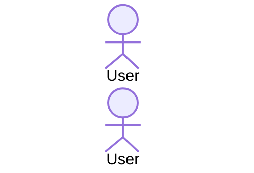
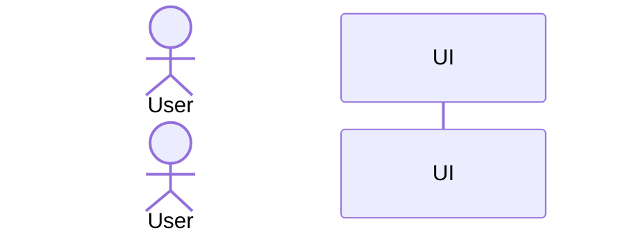
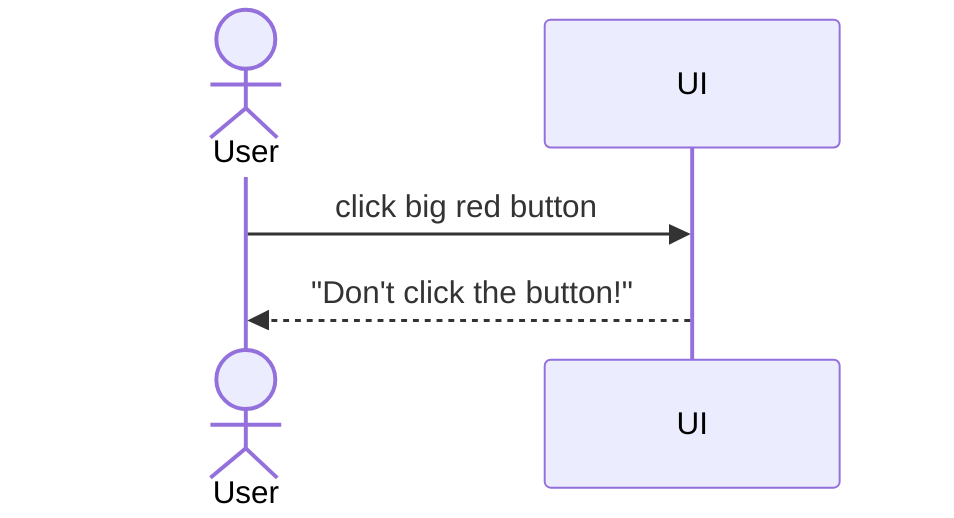
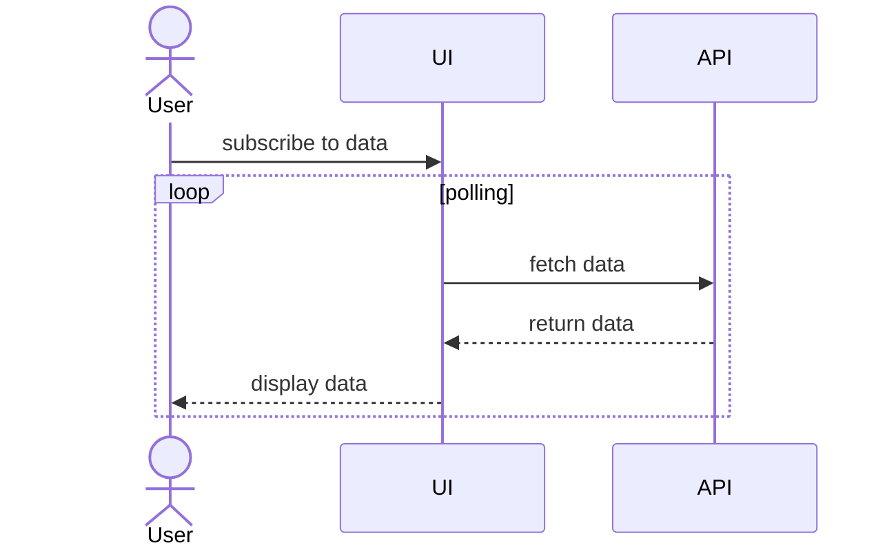
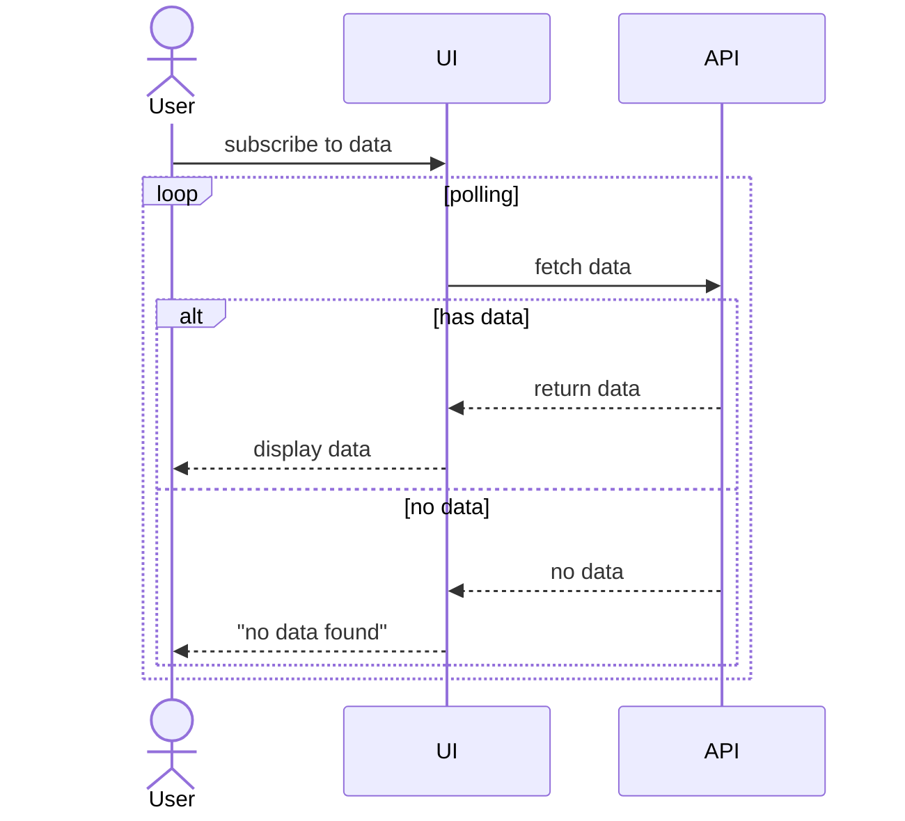
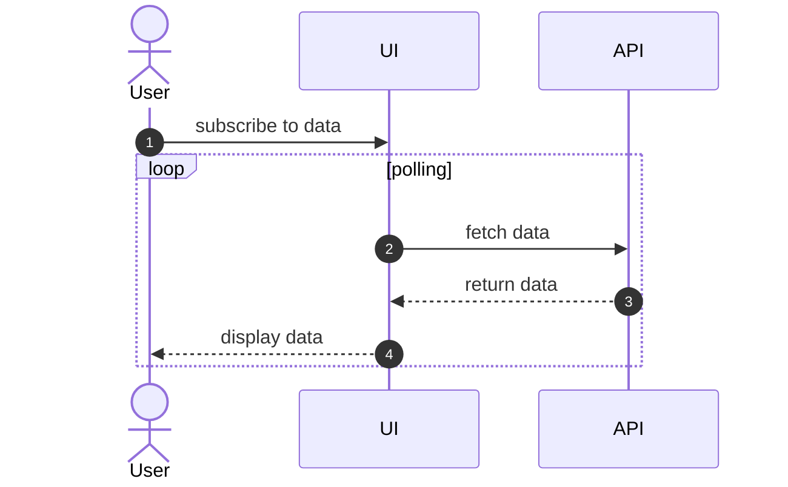
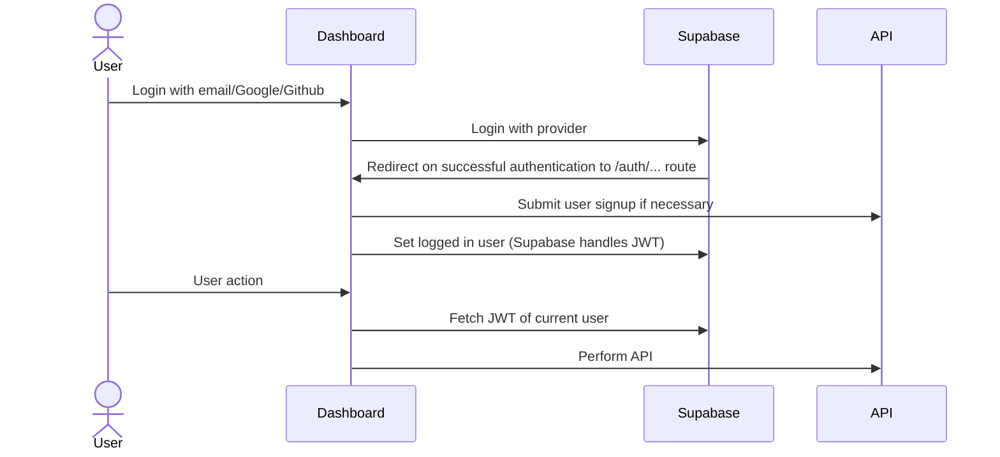
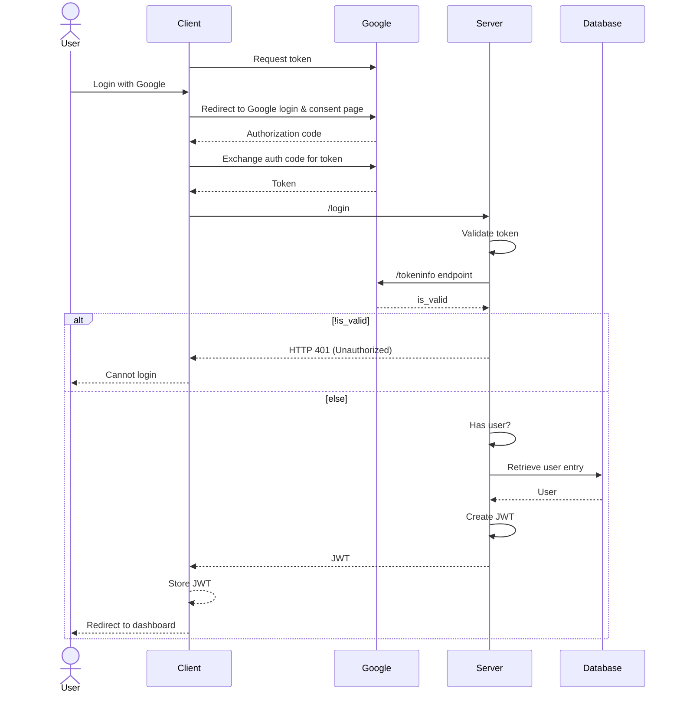
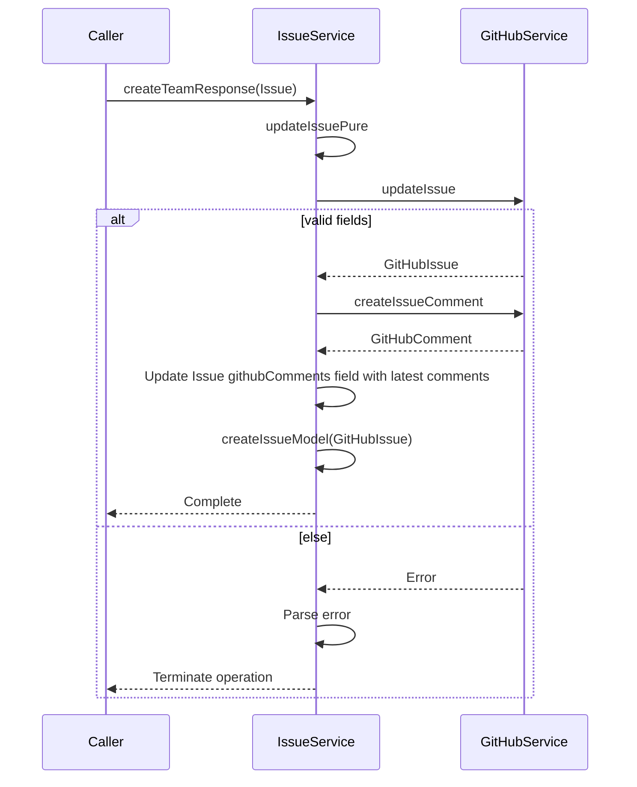

Uncle Bob (Robert C. Martin) wrote in [Clean Code](https://www.amazon.sg/Clean-Code-Handbook-Software-Craftsmanship/dp/0132350882) that "the ratio of time spent reading versus writing is well over 10 to 1. We are constantly reading old code as part of the effort to write new code..."

As software engineers, reading code is our bread and butter. Maintaining a legacy system? You have to read the legacy code. Want to build a website? You're reading framework and library documentations. Contributing to a project? You are combing through existing code to figure out how everything works before contributing meaningfully. Writing a Request For Comments (RFC)? Guess what? You have to read the old code to propose changes to it.

It is an immutable part of software engineering, yet after talking to various engineers, I have come to realize that there is no well-defined system to understand and navigate complex codebases.

So today, I will try to introduce a system I have used throughout the years to understand large systems and start contributing to them within hours: **sequence diagrams**.

## Practical sequence diagrams

You might remember sequence diagrams from a software engineering class you took where your takeaway was that UML diagrams like sequence diagrams are fraught with rigid rules and terminology. [1]

However, my approach to sequence diagrams focuses on its practical applications, and adapting it to work within a more "realistic" software engineering environment.

I believe that sequence diagrams should be used to understand how software components interact with each other. So, it is less important that you remember what a lifeline is or ensure that class names are underlined, but rather, focus on using sequence diagrams as a visual tool on top of note-taking.

In fact, my flow for tracing codebases using sequence diagrams is very simple:

1. Open Notion or VS Code
2. Create a new page or Markdown file
3. Create a codeblock for Mermaid
4. Find an entry point for the code you are interested in
5. Trace the code by jumping through definitions and following each line
6. Add the important details into the sequence diagram
7. In the rest of the document, add any additional details to supplement the diagram

Before I explain what is considered "important details" for the sequence diagram or how to construct the sequence diagrams, I will first cover the basics of Mermaid, the tool I use to generate sequence diagrams using code.

## Mermaid crash course

:::callout{.info}
I will only cover the very bare minimum you need to create sequence diagrams. These are all the notations I use 99% of the time.

If you are interested in learning more, feel free to refer to the [official documentation](https://mermaid.js.org/syntax/sequenceDiagram.html).
:::

To start with creating a sequence diagram in Mermaid, you need to declare the diagram type:

```text
sequenceDiagram
```

Then, you can declare actors via `actor <name>`:


```text
sequenceDiagram
  actor User
```

This generates a stick figure you can use to represent users:



I use the `actor` to represent users of the system. Very often, they are the people who trigger some codeflow that I am interested in.

You can also generate lifelines via `participant <name>`:

```text
sequenceDiagram
  actor User
  participant UI
```



These `participant` objects are used to represent the various files/classes/components that the sequence diagram aims to capture.

Then, to illustrate messages between entities, you can use `->>` for solid lines and `-->>` for dashed lines (often associated with return values). After each line, you have to specify the message through `: <message>`

```text
sequenceDiagram
  actor User
  participant UI

  User ->> UI : click big red button 
  UI -->> User : "Don't click the button!"
```



The messages can either be function call signatures, or descriptions of the function calls and return types.

Loops can be expressed using the `loop <name> <condition> ... end` syntax:

```text
sequenceDiagram
  actor User
  participant UI
  participant API

  User ->> UI : subscribe to data
  loop polling
    UI ->> API : fetch data
    API -->> UI : return data
    UI -->> User : display data
  end
```



You can also specify "alternative" code paths (or branches) using `alt <condition> ... else <else> ... end`:

```text
sequenceDiagram
  actor User
  participant UI
  participant API

  User ->> UI : subscribe to data
  loop polling
    UI ->> API : fetch data
    alt has data
      API -->> UI : return data
      UI -->> User : display data
    else no data
      API -->> UI : no data
      UI -->> User : "no data found"
    end
  end
```



You can also enable sequence numbers by adding `autonumber` to the top of the diagram:

```text
sequenceDiagram
  autonumber

  actor User
  participant UI
  participant API

  User ->> UI : subscribe to data
  loop polling
    UI ->> API : fetch data
    API -->> UI : return data
    UI -->> User : display data
  end
```



That's all you really need to know. There are plenty of other notations like `par` and `note`, but I generally do not use them.

Now that you have a general understanding of Mermaid, I can now introduce how I approach using sequence diagrams through the concept of "fidelity".

## Sequence diagram fidelities

I borrow the term "fidelity" from prototyping, which refers to the level of detail, accuracy, and realism of a prototype compared to the final product. [2]

Similar to prototyping, there are the three levels of fidelity I work with:

1. Low-fidelity
2. Medium-fidelity
3. High-fidelity

The choice of fidelity is clear when you ask the question, "How much details do I need to capture in the diagram?"

### Low-fidelity

Low-fidelity sequence diagrams focus on component-component or user-component interactions. A lot of low-level details are omitted, such as individual function calls.

Often, I use these as a starting point to understand the "big picture" of a system.

For instance, this was a low-fidelity sequence diagram I created to understand how Supabase authentication works.



Rather than spending time trying to map out the individual underlying function calls, such as how user signup submission is handled, I focus on representing the system through the actor `User` and participants `Dashboard`, `Supabase`, and `API` (representing the high-level components of the system). Every message describes the high-level interactions between actors and participants.

Low-fidelity sequence diagrams are very useful to give you a bird's eye view of how a system works, and how user interactions look like. However, you may be interested in understanding how certain components work while maintaining a bird's eye view of the entire system. This is where medium-fidelity sequence diagrams come in.

### Medium-fidelity

Medium-fidelity sequence diagrams often involve both high-level component-component or user-component interaction, and some low-level details within these interactions.

For instance, this was a medium-fidelity sequence diagram I used to understand how the Google OAuth2.0 authorization flow works (which might not be 100% accurate).



This diagram contains both high-level component-component and user-component interactions (e.g. between `Client` and `Google`) and some lower-level information (e.g. between `Server` and `Database`) where details like how the information is retrieved and what is returned is captured as individual messages.

However, I prefer to avoid using medium-fidelity diagrams. As you can see, these diagrams can grow unwieldy very quickly as more high-level components are introduced, which becomes hard to understand and maintain. 

Instead, what I often do is create a low-fidelity sequence diagram with message numbers (using `autonumber`), and attach additional notes (through text or as high-fidelity sequence diagrams) to each of the relevant message numbers.

But for cases where the number of components are still reasonable, medium-fidelity diagrams are still a good middle ground to provide a bird's eye view of the system while having some details fleshed out.


### High-fidelity

Rather than focusing on the "big picture" like low-fidelity or medium-fidelity sequence diagrams, high-fidelity sequence diagrams are designed to drill deep into the interaction between a very small subset of components.

For instance, this was a high-fidelity sequence diagram I created to explain a change I was proposing for a [pull request](https://github.com/CATcher-org/CATcher/pull/1264):



Here, I focus solely on the interactions between the `IssueService` and `GitHubService`, with `Caller` acting as an "anchor" for what initiates this interaction. In high-fidelity sequence diagrams, focus on mapping out the individual function calls like `createTeamReponse(Issue)` or providing high-level descriptions of each step, explaining the "how" behind the interaction.

Some functions may include many individual function calls that are not relevant to understanding the current interaction. For these cases, I typically summarize them as a high-level message. High-fidelity diagrams try to capture the relevant low-level details of the interaction, so any irrelevant details can be omitted or summarized.

## General guidelines

Now that I have established my system of creating sequence diagrams, these are some general guidelines I try to follow to keep myself sane:

1. **Keep it to under 50 messages**

    If you realize that the diagram is growing extremely large, then it is probably time to break it out into separate diagrams.

2. **Avoid adding notes within the diagram itself** 

    Instead, add message numbers using `autonumber` and add notes outside of the diagram to reduce clutter.

3. **Don't get sucked into representing every little interaction** 

    Depending on your goal, you should try to aim for clarity over comprehensiveness in your messages. Save the little interactions for other sequence diagrams or notes.

4. **Treat sequence diagrams as living documentation** 

    Upload these diagrams to your repository, revisit them, and update them as changes are made. Do what you can to keep these diagrams and notes up-to-date as it benefits both you and future maintainers.

5. **Keep asking questions**
  
    As you comb through the codebase and add the interactions to your sequence diagrams, leave questions (or `TODO` comments) about components that you find interesting or are unsure about. If these impede your understanding of the codebase, you have found a blocker, else, these act as good things to return to down the road.

## Closing

That's it! It's a relatively simple system that I started using a few years ago and found it to be quite effective in both personal projects or during my internships, allowing me to create pull requests within hours of being introduced to a codebase.

"Oh, but this feels like a lot of extra effort..." you might lament. 

And to that, I answer, "You are absolutely right!" 

This is a system that takes a bit of time to get used to, and it does add a layer of overhead to your approach to codebases. However, I think that benefit of having a living learning document/page/repository is crucial in becoming more productive as a developer, understanding systems, and realizing where your contributions fit into the "bigger picture". 

I also find that the act of creating documentation and writing about the systems I interact with has made me a better communicator of my ideas and understanding. These diagrams have also helped my teammates understand the system and some have even become staples within the team's repositories!

So, give this system a go and let me know what you think! Enjoy!

---

[1] [IBM's introduction to sequence diagrams](https://developer.ibm.com/articles/the-sequence-diagram/)

[2] [Low-Fidelity vs. High-Fidelity Prototyping: Key Differences Explained](https://www.protopie.io/blog/low-fidelity-vs-high-fidelity-prototyping)
