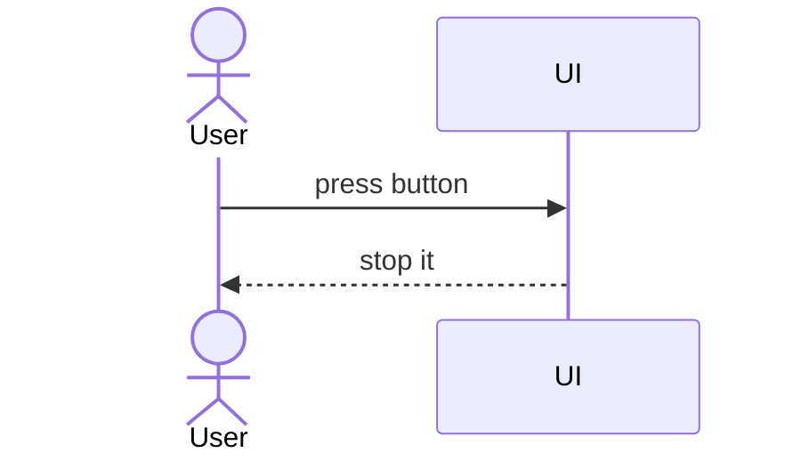

I just added [Mermaid](https://mermaid.js.org/) support for posts in this blog!

Now, 

```text
sequenceDiagram
  actor User
  participant UI
  
  User ->> UI : press button
  UI -->> User : stop it
```

Can be rendered as:



This is all thanks to this guide I found: <https://realfiction.net/posts/mermaid-in-astro/>

I added this for my latest article: [Understanding Systems with Sequence Diagrams](/post/understanding-systems-with-sequence-diagrams).
